# **Apache - JMeter**
Repository to practice the using of JMeter, an Open-Source project for many different of tests, like Stress, Performance and Load tests.

- [**Apache - JMeter**](#apache---jmeter)
- [**Using JMeter for Different Tests**](#using-jmeter-for-different-tests)
	- [**How to install Apache JMeter**](#how-to-install-apache-jmeter)
		- [**Pre-requisites**](#pre-requisites)
		- [**Installation**](#installation)
		- [**Post-Installation**](#post-installation)
	- [**Types of Tests**](#types-of-tests)
		- [**Smoke Test**](#smoke-test)
		- [**Load Test**](#load-test)
		- [**Stress Test**](#stress-test)
		- [**Spike Test**](#spike-test)
		- [**Endurance Test**](#endurance-test)
	- [**Test Plan**](#test-plan)
		- [**Test Plan Structure**](#test-plan-structure)
		- [**Elements of a Test Plan**](#elements-of-a-test-plan)
			- [**Thread Group**](#thread-group)
				- [**How to add a Thread Group**](#how-to-add-a-thread-group)
				- [**Properties of a Thread Group**](#properties-of-a-thread-group)
				- [**Configuration Elements**](#configuration-elements)
				- [**Controllers**](#controllers)
				- [**Timer**](#timer)
				- [**Assertion**](#assertion)
			- [**Listener**](#listener)
		- [**Execution Order and Rules**](#execution-order-and-rules)
			- [**Types of Elements in the Tree Structure**](#types-of-elements-in-the-tree-structure)
			- [**Execution Order**](#execution-order)
			- [**Configuration Elements Rules**](#configuration-elements-rules)
			- [**General Rules**](#general-rules)
		- [**Test Fragments**](#test-fragments)
	- [**Important Application Performance Metrics**](#important-application-performance-metrics)
- [How to record actions in JMeter](#how-to-record-actions-in-jmeter)
	- [**Http(s) Test Script Recorder**](#https-test-script-recorder)
	- [**BlazeMeter Chrome Extension**](#blazemeter-chrome-extension)
- [**Execute the Tests in CLI mode**](#execute-the-tests-in-cli-mode)
	- [**APDEX - Dashboard**](#apdex---dashboard)
		- [**APDEX Response Time Classification**](#apdex-response-time-classification)
		- [**APDEX Score Formula**](#apdex-score-formula)
- [**JMeter Distributed Mode**](#jmeter-distributed-mode)
	- [**JMeter Distributed Mode Architecture**](#jmeter-distributed-mode-architecture)

# **Using JMeter for Different Tests**

## **How to install Apache JMeter**

### **Pre-requisites**

- Copy and clone the repository **`ODataProject`** from this URL ([**https://github.com/licjapodaca/ODataProject**](https://github.com/licjapodaca/ODataProject)) this will be the API Rest project that we will test during the course.

- Install Java SE JDK v8 ([**https://www.oracle.com/technetwork/java/javase/downloads/index.html**](https://www.oracle.com/technetwork/java/javase/downloads/index.html))
- Download and extract JMeter `v5.1.1` binaries ([**https://jmeter.apache.org/download_jmeter.cgi**](https://jmeter.apache.org/download_jmeter.cgi))

### **Installation**

For best practices, recommends that you extract the JMeter binaries at root level of your hard drive:

```shell
C:\JMeter\> 
```

### **Post-Installation**

- Download the Plugin Manager jar file ([**https://jmeter-plugins.org**](https://jmeter-plugins.org/))

	The downloaded file must be locate at **`JMETER_HOME\lib\ext`** folder once you extract the JMeter binaries.

- Recommended plugins to install from **`Plugin Manager`**:

  - Custom Thread Groups
  - 3 Basic Graphs
  - Throughput Shaping Timer
  - Dummy Sampler

- In every Test Plan, use the **`Http Request Defaults`** config element to use the **`HttpClient4`** implementation.

- Uncomment from the file **`JMETER_HOME\bin\jmeter.properties`** the following lines:

```properties
hc.parameters.file=hc.parameters
httpclient4.retrycount=10
```

- Add at the end of the file **`JMETER_HOME\bin\hc.parameters`** the following line:

```properties
http.connection.stalecheck$Boolean=true
```

- Finally, restart **JMETER**.

## **Types of Tests**

There are so many types of `Performance Tests`, like `Smoke Tests`, `Load Tests`, `Stress Tests`, `Spike Tests` and `Endurance Tests`.

**The two ways to generate load**

- Number of users
- Number of Requests

The next step is to decide what kind of performance test your are going to execute:

### **Smoke Test**

Always you are going to execute first a `Smoke Test`, the purpose of this test is to verify if the complete script test is correctly configured.


### **Load Test**

Is a test that is performed at a specific load level. Usually you'll perform load test at many load levels to monitor the behavior of the application.


>**Note:** >**Note:** For this type of test, it requires more advance `Threads Groups`.

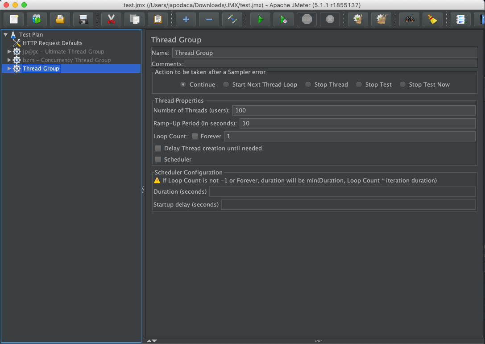

### **Stress Test**

Is a test that test the application with loads beyond its normal usage to see up to which point it stays stable and responsive. In a stress test you can add users in steps or constantly over a period of time or you can add a lot of users during that long period of time and see at what point the application stop working.


>**Note:** For this type of test, it requires more advance `Threads Groups`, like `Ultimate Thread Group` or `Concurrency Thread Group`.

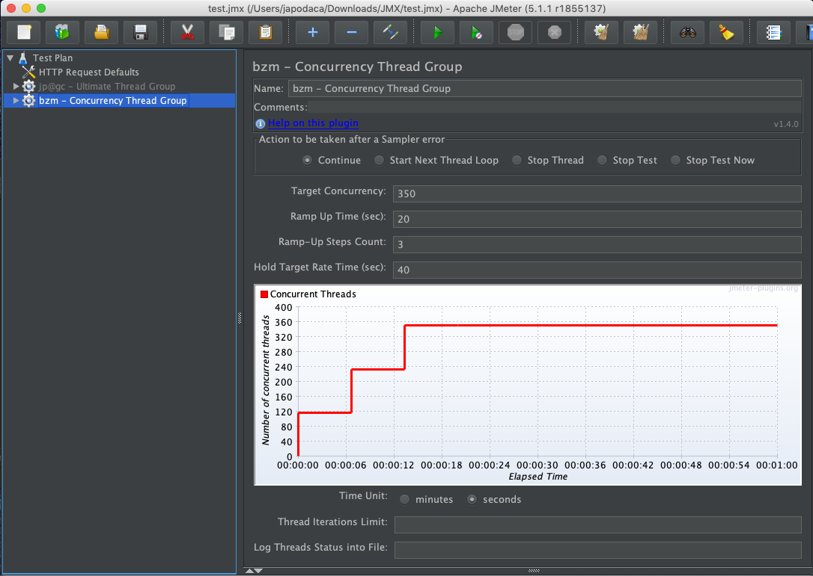

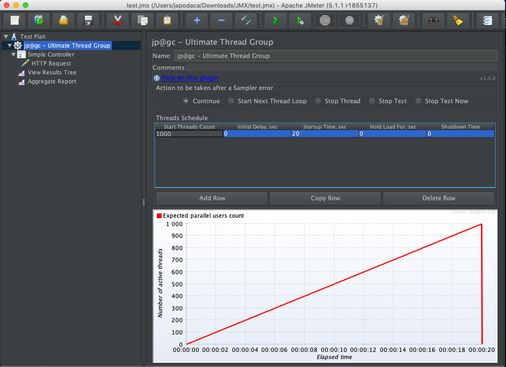

### **Spike Test**

Is a test when an application is subjected to brief periods of sudden increments in the load beyond its maximum capacity to see if the application is robust enough to work correctly during and after the Spike.

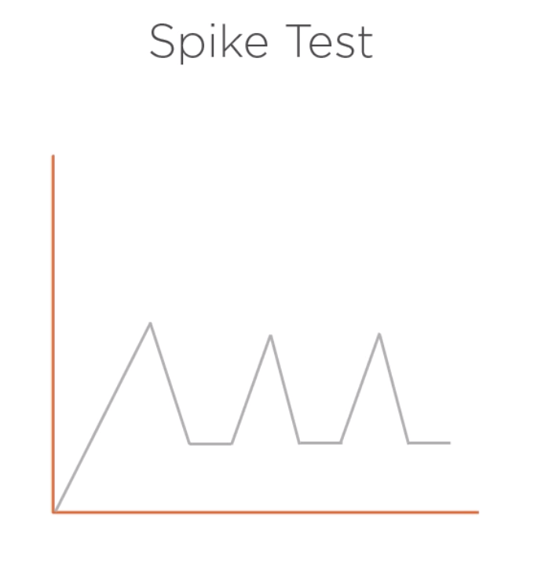

>**Note:** For this type of test, it requires more advance `Threads Groups`, like `Ultimate Thread Group`.

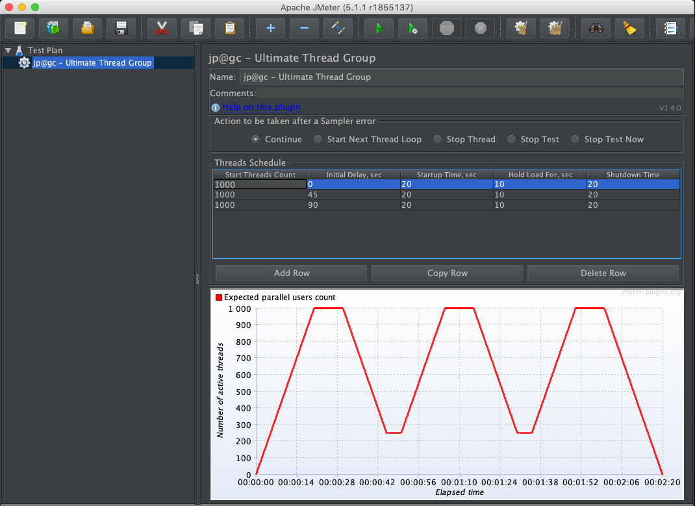

### **Endurance Test**

Is a test when an application is subjected to load within its limits, but for long duration, hours, or in some cases days, to see if the application has memory leaks or doesn't properly close database or network connections.

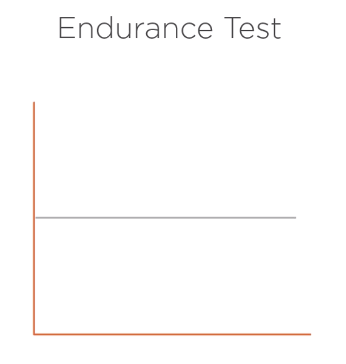

For this type of test, it requires more advance `Threads Groups`, like `Ultimate Thread Group`.

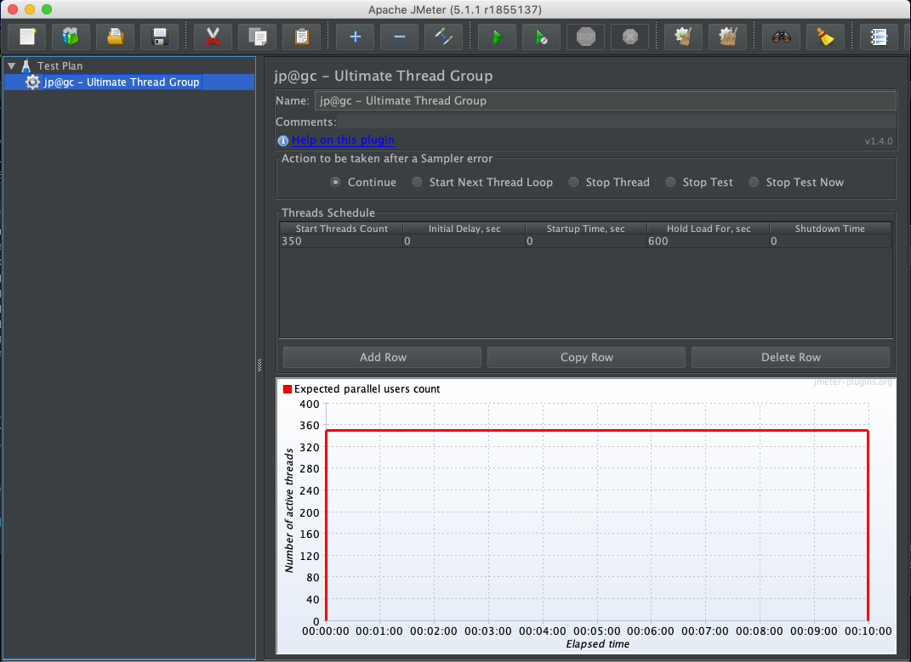

## **Test Plan**

The root element of a test, where its overall settings are specified and all the other elements are contained.

The following window explain the parts of a Test Plan in JMeter:


### **Test Plan Structure**


### **Elements of a Test Plan**


#### **Thread Group**

Controls the number of threads (users) JMeter will use to execute a test.

>**NOTE:** A `Thread Group` represent a Test Case.

##### **How to add a Thread Group**


##### **Properties of a Thread Group**

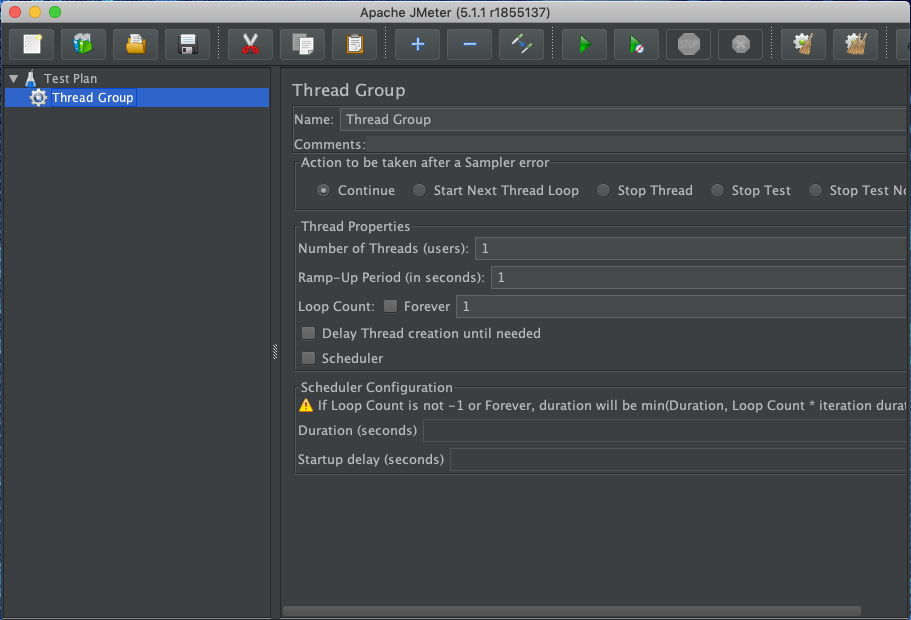

##### **Configuration Elements**

Used to setup default configurations and variables for later use.

These are the **`config elements`** that JMeter manage:


##### **Controllers**

Controllers are the children of **`Thread Groups`** and there are 2 types of controllers:

- **Logic Controllers.** Let you customize the logic to decide when to send requests.


- **Samplers.** Perform a request, generating one or more results.

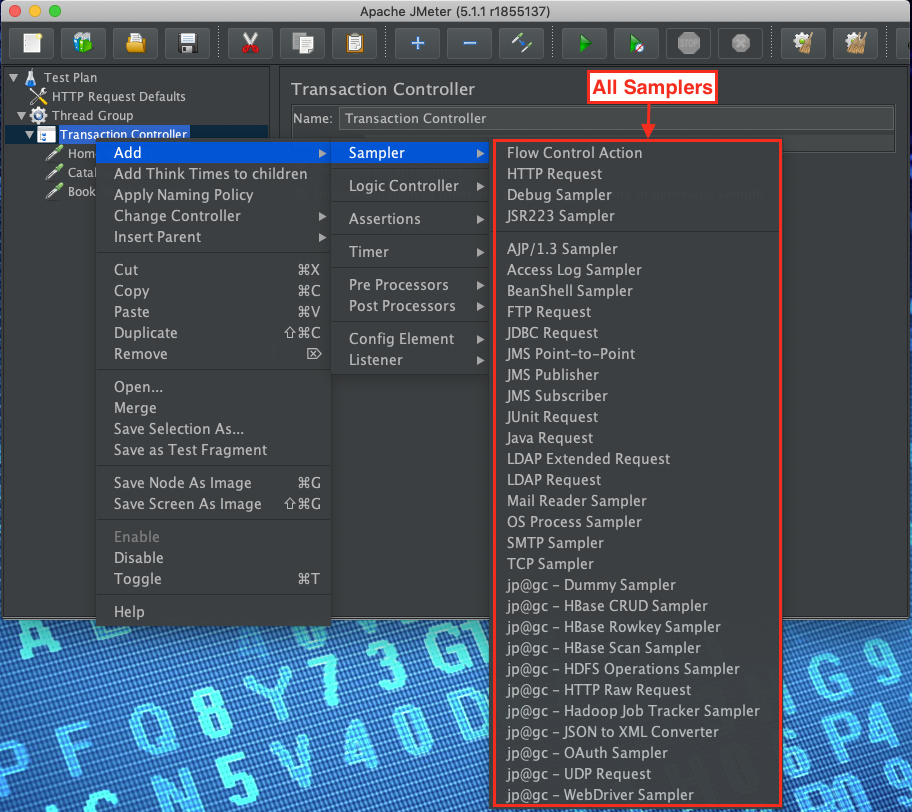

##### **Timer**

Under a **`sampler`** or under a **`Thread Group`**, there are **`Timers`**, that introduce a delay (pause) between requests.


**Timer Example:**


##### **Assertion**

Assertions validate a response is as expected.


#### **Listener**

Listen to responses and aggregate metrics.


### **Execution Order and Rules**

#### **Types of Elements in the Tree Structure**

- **Ordered**
  - Controllers and Samplers
	
	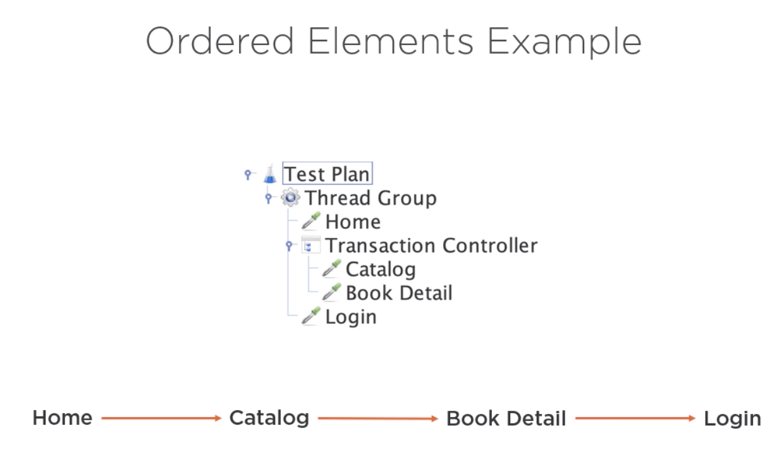

- **Hierarchical (scoped)**
  - Everything else (config elements, assertions, timers, etc.)

	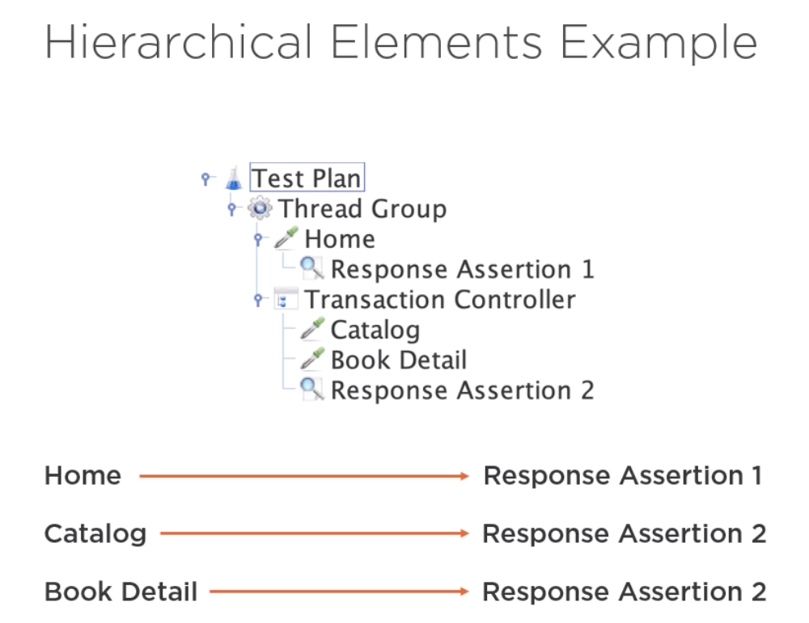

#### **Execution Order**


>**IMPORTANT:** The last 3 elements do not execute if the server is not responding.

#### **Configuration Elements Rules**

- The **`User Defined Variables`** configuration element is processed at the start of a test, no matter where it is placed.
- A configuration element inside a tree branch has higher precedence than another element of the same type in a outer branch.
  - **`Configuration Default`** elements are merged, Managers are not.

**Example:**


#### **General Rules**

- Elements are rearranged according to the order of execution.
- Outer elements are executed before inner elements of the same type.
- Some elements are executed before or after each sampler in their scope.
  - If there is more than one element of the same type in the scope, all of them will be processed before or after the sampler.

**Example 1:**


**Example 2:**


**Example 3:**


**Example 4:**


### **Test Fragments**

Hold other elements inside for the purpose of reusing.

Controllers that reference `Test Fragments`:

- **Module Controllers.** References test fragments in the same `Test Plan`.
- **Include Controllers.** References test fragments in external JMeter files.

## **Important Application Performance Metrics**

- **Response Time**

	The spend time that an endpoint response.

- **Throughput**

	The number of transactions or KB/Sec.

- **Error Rate**

	Percentage of errors during a test.

These metrics are important to measure the server performance in terms of:

- CPU
- Memory
- Network

# How to record actions in JMeter

There are two ways to record actions in JMeter:

- **Http(s) Test Script Recorder**
- **BlazeMeter Chrome Extension**

## **Http(s) Test Script Recorder**

You need to follow some requirements for this kind of recorder tool:

- You need Mozilla Firefox to use its Proxy Server.
- Configure the `proxy.cert.validity` of the certificate `ApacheJMeterTemporaryRootCA.crt` in the file `JMETER_HOME\bin\jmeter.properties`.
- Install the last certificate in Firefox.
- Configure the Proxy Server in Firefox.

## **BlazeMeter Chrome Extension**

Requirements for this tool:

- Install this extension from ([**https://chrome.google.com/webstore/detail/blazemeter-the-continuous/mbopgmdnpcbohhpnfglgohlbhfongabi?hl=en**](https://chrome.google.com/webstore/detail/blazemeter-the-continuous/mbopgmdnpcbohhpnfglgohlbhfongabi?hl=en))
- Subscribe in `blazemeter.com` to create a `BlazeMeter` user until you successfully install the Chrome Extension.

# **Execute the Tests in CLI mode**

To execute the tests in CLI mode, you just need to type the following command with its correct parameters:

```shell
jmeter -n -t test5.jmx -l results.csv -e -o output -f
```

## **APDEX - Dashboard**

APDEX or **`Application Performance Index`** dashboard, measures user's satisfaction, taking into account the response time of the application.

### **APDEX Response Time Classification**

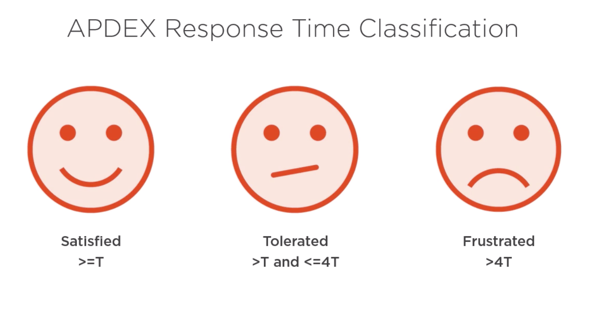

### **APDEX Score Formula**

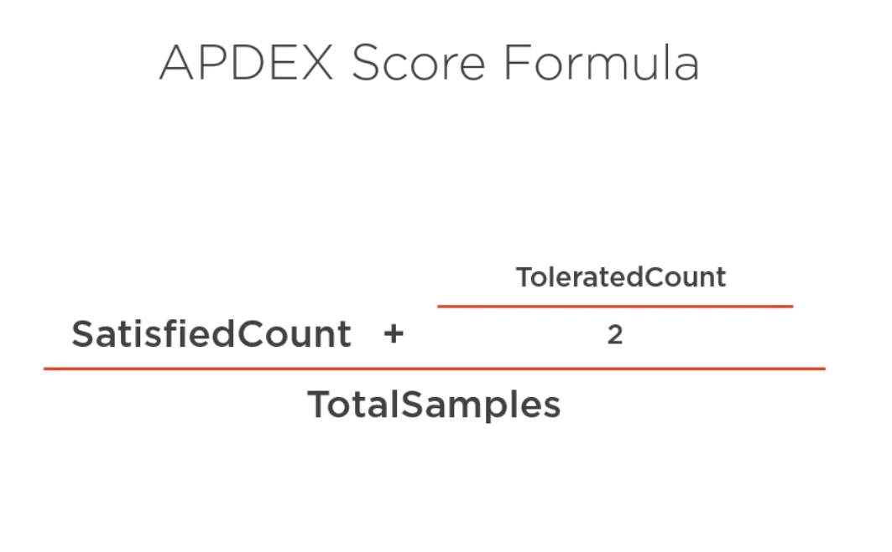

# **JMeter Distributed Mode**

There are certain limitations to the number of users you can run, with the CPU and RAM configuration for a single machine.

## **JMeter Distributed Mode Architecture**


**Resource sites:**

- [**http://blazedemo.com**](http://blazedemo.com)
- [**https://the-internet.herokuapp.com/login**](https://the-internet.herokuapp.com/login)
